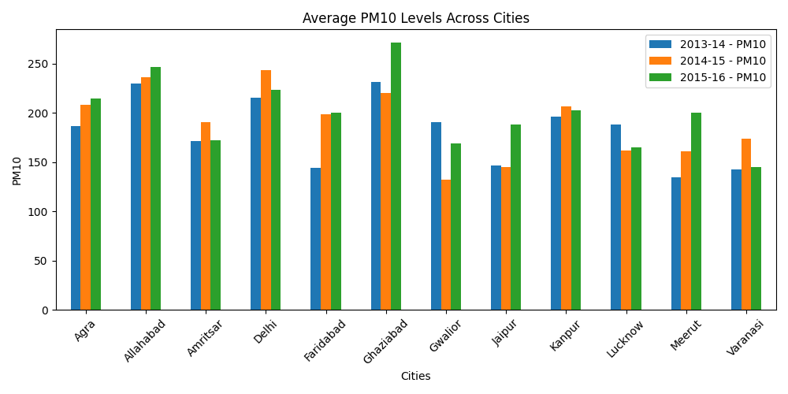
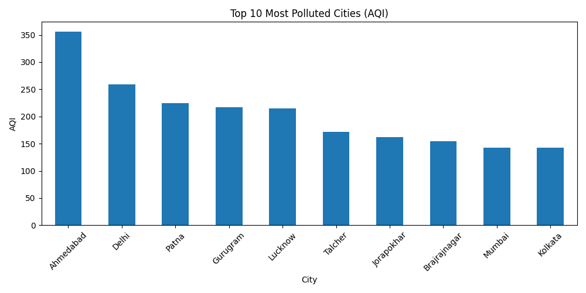
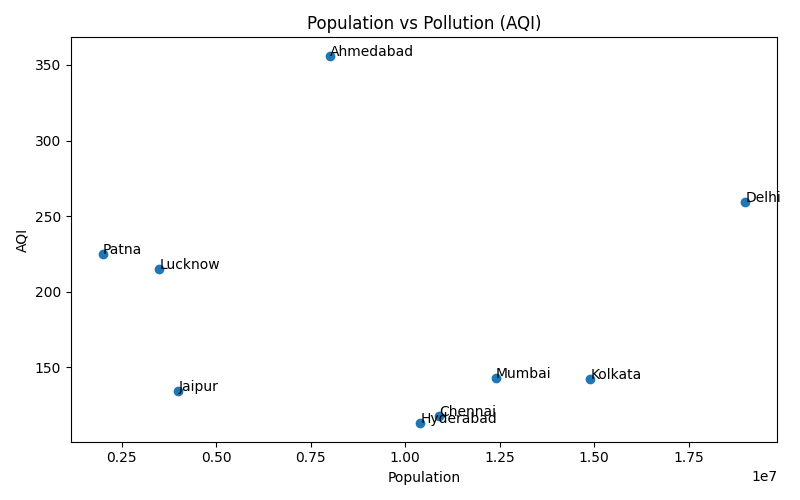
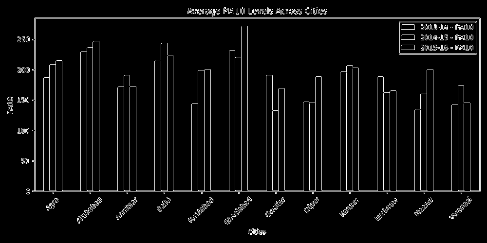

# 🌍 Smart India Mapping using Big Data

<p align="center">
  
  
  
  
</p>

---

## 📌 Overview

This project analyzes and visualizes **air pollution trends across Indian cities** using **big data analytics, geospatial mapping, and demographic insights**.

It combines:

* 📊 Environmental data (PM10, AQI)
* 🧑‍🤝‍🧑 Demographic data (population)
* 🗺️ Geospatial visualization (maps & heatmaps)

👉 Goal: **Understand how pollution varies geographically and how it relates to population density.**

---

## 🎯 Objectives

* Analyze air pollution levels across cities
* Identify highly polluted regions using AQI
* Visualize pollution using graphs and interactive maps
* Integrate demographic data for deeper insights
* Demonstrate real-world application of big data

---

## 📊 Datasets Used

| Dataset             | Description                     |
| ------------------- | ------------------------------- |
| Government Dataset  | Pollution data (data.gov.in)    |
| Kaggle Dataset      | 29,000+ city-wise AQI records   |
| Demographic Dataset | Population data of major cities |

---

## ⚙️ Tech Stack

* 🐍 Python
* 📊 Pandas
* 📈 Matplotlib
* 🗺️ Folium
* 👁️ OpenCV

---

## 🔍 Features

✔ Data cleaning & preprocessing
✔ PM10 trend analysis
✔ AQI-based city ranking
✔ Interactive India map
✔ Heatmap visualization
✔ Population vs AQI analysis
✔ Computer Vision (Edge Detection)

---

## 📷 Sample Outputs

### 📊 PM10 Analysis

<p align="center">
  
</p>

---

### 📊 Top 10 Polluted Cities (AQI)

<p align="center">
  
</p>

---

### 📈 Population vs AQI

<p align="center">
  
</p>

---

### 👁️ Edge Detection (Computer Vision)

<p align="center">
  
</p>

---

## 🗺️ Interactive Maps

| Map Type             | Link                                                |
| -------------------- | --------------------------------------------------- |
| Basic Pollution Map  | [View Map](outputs/india_pollution_map.html)        |
| Advanced AQI Heatmap | [View Heatmap](outputs/advanced_pollution_map.html) |

---

## 🧠 Key Insights

* Highly populated cities tend to show higher pollution levels
* Certain cities exhibit extremely high AQI values
* Heatmap reveals pollution hotspots across India
* Pollution patterns correlate with urban density

---

## ⚠️ Limitations

* Limited demographic features (only population used)
* Coordinates are manually assigned
* Missing AQI categories approximated

---

## 🚀 How to Run

```bash
# Step 1: Create virtual environment
python -m venv venv

# Step 2: Activate environment
venv\Scripts\activate   # Windows

# Step 3: Install dependencies
pip install -r requirements.txt

# Step 4: Run project
python app.py
```

---

## 📌 Conclusion

This project demonstrates how **big data analytics + geospatial visualization + demographic insights** can be combined to analyze environmental challenges and support sustainable development decisions.

---

## 👨‍💻 Contributors

* Har Aziz Singh
* Kuldeep Jakhar
* Akshit Jain

---

## ⭐ Acknowledgment

* Government of India (data.gov.in)
* Kaggle datasets
